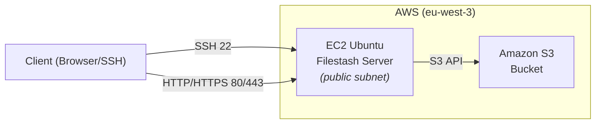
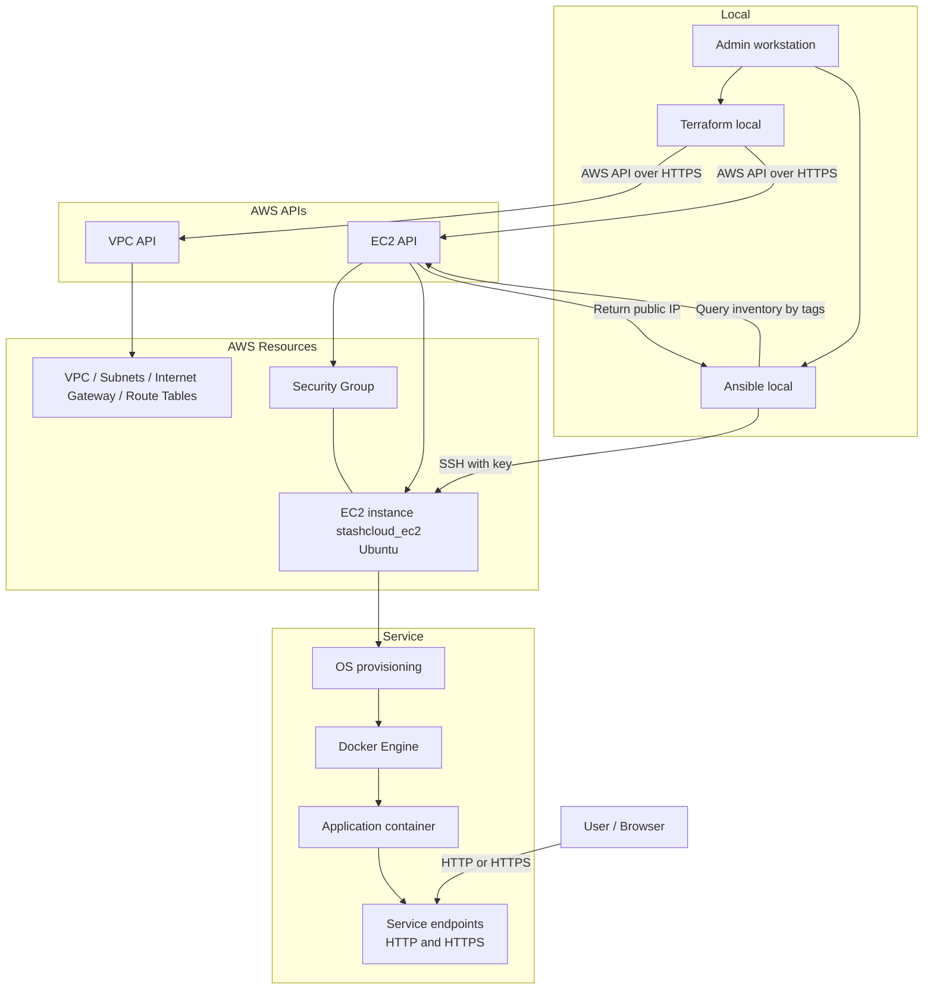

# Stashcloud – Lightweight Cloud Storage Manager

This project deploys a web-based file management application on AWS, using Filestash as the web interface and Amazon S3 (Object Storage) for file storage.

The infrastructure is automated with Terraform and Ansible.

## Prerequisites
- A local Linux machine with Terraform, Ansible, Docker, Docker Compose, AWS CLI, and Git installed (tested versions: Terraform 1.14.3, Ansible 2.10.8, Docker 29.2.0, Docker Compose 5.0.2, aws-cli 2.33.12).
- An Amazon Web Services account with programmatic access enabled (Access Key ID and Secret Access Key) or an IAM role usable by Terraform.
- An SSH public key registered in the account for EC2 key-pair creation, with the matching private key stored on your local workstation for SSH access.

## Architecture 
High-level view of the target architecture and the main network flows between the client, the Filestash VM, and the S3-compatible Object Storage bucket.




The target architecture includes:
- An Ubuntu Public Cloud instance (VM) to host Filestash and an Nginx server.
- A Filestash Docker container (web application) accessible through Nginx (which will act as an HTTPS reverse proxy).
- An Amazon S3 bucket to store uploaded files.


## Repository structure

```text
stashcloud/
├─ .git/                         
├─ .gitignore                    # Ignore Terraform state/cache and any *.tfvars secrets
├─ README.md                     
├─ ansible/                      
│  ├─ ansible.cfg                # Ansible settings
│  ├─ inventories/
│  │  └─ aws_ec2.yaml            # Dynamic inventory (AWS EC2 plugin) + host compose
│  ├─ group_vars/                # Group variables split by host groups
│  │  ├─ backend/
│  │  │  └─ main.yml             # Variables for backend hosts
│  │  └─ frontend/
│  │     └─ main.yml             # Variables for frontend hosts
│  ├─ playbooks/
│  │  ├─ provision_back.yml      # Backend provisioning playbook
│  │  ├─ provision_front.yml     # Frontend provisioning playbook
│  │  └─ site.yml                # Main entrypoint playbook (orchestrates roles/plays)
│  └─ roles/
│     └─ base/
│        ├─ handlers/
│        │  └─ main.yml          
│        └─ tasks/
│           └─ main.yml          # Base tasks (updates, Docker install, etc.)
└─ terraform/                    
   ├─ main.tf                    # Provider block, network, security group, EC2 resources
   ├─ variable.tf                # Input variables (aws_region, admin_ip, etc.)
   └─ .terraform.lock.hcl        
 
Note: terraform/terraform.tfstate* and terraform/.terraform/ exist locally but are intentionally ignored by Git for security concerns.
```

## Provisionning




```bash
#Creates infrastructure
cd ~/stashcloud/terraform
terraform init
terraform plan
terraform apply

#Instances installs and configuration
cd ~/stashcloud/ansible
ansible-playbook -i inventories/aws_ec2.yaml playbooks/provision_front.yml
```

## Security

### SSH access

Connect using your private key and the instance public IP from Terraform:

```bash
ssh -i ~/.ssh/id_ed25519 ubuntu@$(terraform output -raw ec2_public_ip)
```

### Measures already in place

* SSH restricted to `admin_ip` via the security group (port 22 allowed only from your /32).
* No password authentication: the Ubuntu image uses key-based SSH only by default.
* IMDSv2 enforced: metadata access requires a session token.

## Current project status

* A t3.micro instance on Amazon Web Services (region eu-west-3, Paris) is up and running with Ubuntu 24.04 LTS.
* The VM resides in a dedicated VPC public subnet and is reachable via its public IPv4; SSH access is restricted to your `admin_ip` by the security-group rule.
* This instance will host the Filestash application later, to be deployed with Docker/Ansible.
