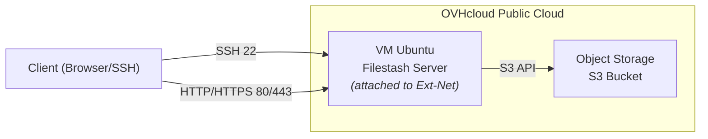

# Stashcloud – Self-Hosted File Storage

This project deploys a web-based file management application (upload/download) on OVHcloud, using Filestash as the web interface and OVH Object Storage (S3) for file storage.

The infrastructure is automated with Terraform and Ansible.

## Prerequisites
- A local Linux machine with Terraform, Ansible, Docker, Docker Compose, s3cmd, and Git installed (tested versions: Terraform 1.14.3, Ansible 2.10.8, Docker 29.2.0, Docker Compose 5.0.2, s3cmd 2.2.0).
- An OVHcloud account with an active Public Cloud project, and OVH API keys configured.
- A domain name (for HTTPS access, to be configured later).
- An SSH key configured both on the OVHcloud account (for instance access) and on GitHub (for code deployment).

## Architecture (overview)
High-level view of the target architecture and the main network flows between the client, the Filestash VM, and the S3-compatible Object Storage bucket.




The target architecture includes:
- An Ubuntu Public Cloud instance (VM) to host Filestash and an Nginx server.
- A Filestash Docker container (web application) accessible through Nginx (which will act as an HTTPS reverse proxy).
- An OVHcloud Object Storage (S3 bucket) to store uploaded files.
- A dedicated IAM user with restricted access to this bucket.

## Repository structure
Current project layout (Sprint 1):

```text
stashcloud/
├─ .git/                      # Git repository metadata
├─ .gitignore                 # Git ignore rules (Terraform cache/state, secrets, etc.)
├─ README.md                  # Project overview and documentation
└─ terraform/                 # Terraform configuration (OVH Public Cloud / OpenStack)
   ├─ main.tf                 # Resources (keypair + VM instance)
   ├─ provider.tf             # Providers (ovh, openstack) and version constraints
   └─ .terraform.lock.hcl     # Provider lock file (pinned provider versions)

Note: terraform/terraform.tfstate* and terraform/.terraform/ exist locally but are intentionally ignored by Git for security concerns.
```

## Current project status

Compute layer in place :

* A b2-7 OVHcloud Public Cloud instance running Ubuntu 24.04 LTS has been deployed.
* The VM is connected to the public network (Ext-Net) and is reachable via SSH.
* This VM will act as the server host for the Filestash application (deployed later via Docker/Ansible).
