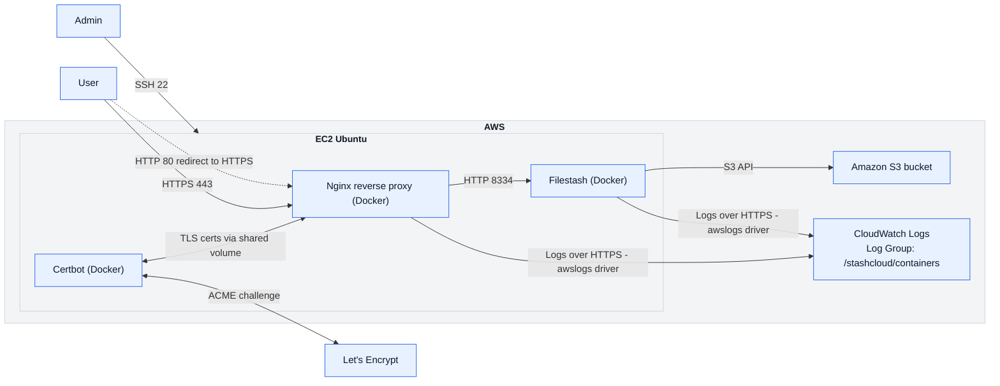
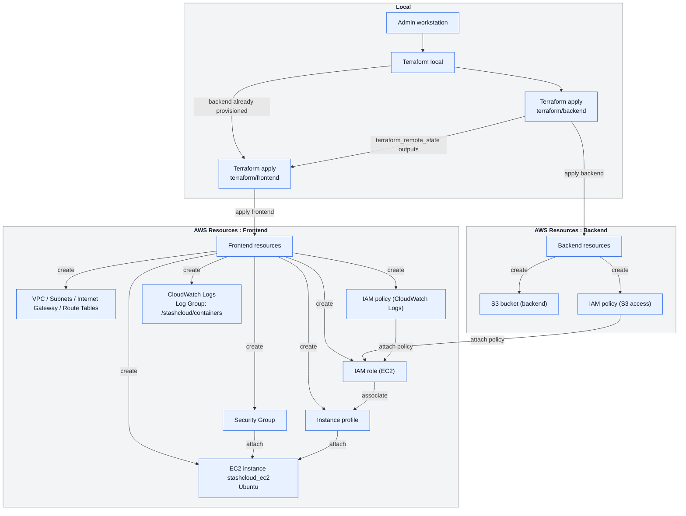
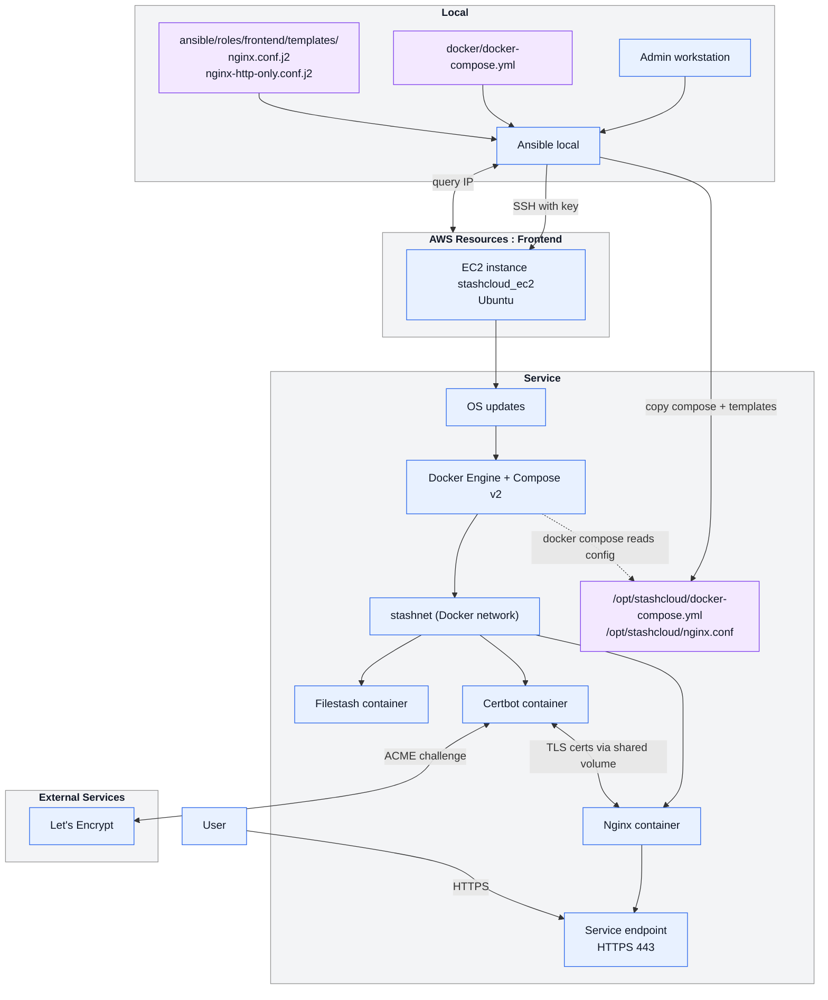

# Stashcloud – Self-managed shared drive

- Fully provisioned end-to-end with Terraform & Ansible.
- Secured : Enforced HTTPS, Least-privilege policies and centralized logging. 

Stashcloud is a secure, ready-to-deploy infrastructure for [Filestash](https://github.com/mickael-kerjean/filestash) — a web-based file manager — with S3-compatible object storage as the backend.

It provides a shared drive accessible from a web browser, without relying on services like 
Google Drive or Dropbox, and without exposing storage credentials to end users.

## TL;DR

### Infrastructure provisionning 
> **Requires:**
> - Docker, Git and AWS CLI installed on your machine
> - AWS credentials configured (`aws configure`)
```bash
git clone https://github.com/gsiegwald/stashcloud.git
cd stashcloud
./run.sh
```

The script will prompt for:
- AWS region (default: `eu-west-3`)
- A valid email address for Let's Encrypt

### Post-deployment setup

#### 1) Set the admin password

Open `https://<EC2_IP_WITH_DASHES>.sslip.io/admin/setup` and set the Filestash admin password.

#### 2) Create users and connect the S3 bucket

In the admin console, go to "Storage" and select "S3" as the backend. 

Under "Authentication Middleware" select "HTPASSWD" and create one ore more users.

Under "Attribute Mapping", select S3 and fill the minimum required fields.

You will need:

- AWS credentials — Your AWS Access Key ID and Secret Access Key
- AWS region — the region you entered at deployment
- IAM role ARN — retrieve with:
```bash
  terraform -chdir=terraform/frontend output -raw ec2_role_arn
```

### Destroy the infrastructure
```bash
./destroy.sh
```
## Prerequisites

* Local workstation with the following tools installed:

  * Terraform (tested: 1.14.3)
  * Ansible (tested: 2.10.8)
  * AWS CLI (tested: 2.33.12)
  * Git
  * Python 3 + pip (recommended to use a virtualenv)

* Python dependencies:
```bash
  python3 -m venv .venv
  source .venv/bin/activate
  pip install -U pip
  pip install boto3 botocore jmespath
```

* Ansible collections :

```bash
  ansible-galaxy collection install amazon.aws community.docker
```

 * An AWS account with programmatic access enabled via an Access Key ID / Secret Access Key configured on your workstation (`aws configure`)

* The AWS credentials used on the workstation must allow managing VPC/EC2/EIP, S3, IAM (roles/policies/instance profiles) and CloudWatch Logs

* Network access :

  * Outbound HTTPS access from your workstation to AWS APIs (Terraform + Ansible inventory)
  * Ability to reach the EC2 instance over SSH (22), HTTP (80) and HTTPS (443)

* A valid email address for Let's Encrypt certificate registration

## Architecture 
High-level view of the target architecture and the main network flows between the client, the Filestash VM, and the S3-compatible Object Storage bucket.


```mermaid
flowchart LR
  %% Infrastructure
  subgraph AWS["AWS"]
    subgraph EC2["EC2 Ubuntu"]
      NGINX["Nginx reverse proxy (Docker)"]
      FS["Filestash (Docker)"]
      CERTBOT["Certbot (Docker)"]
      CERTBOT <-->|TLS certs via shared volume| NGINX
    end
    S3["Amazon S3 bucket"]
    CWL["CloudWatch Logs<br/>Log Group: /stashcloud/containers"]
  end

  LE["Let's Encrypt"]

  %% Network flows
  Admin["Admin"] -->|SSH 22| EC2
  User["User"] -->|HTTPS 443| NGINX
  User -.->|HTTP 80 redirect to HTTPS| NGINX
  NGINX -->|HTTP 8334| FS
  FS -->|S3 API| S3

  %% TLS certificate flow
  CERTBOT <-->|ACME challenge| LE

  %% Centralized logging flows
  NGINX -->|Logs over HTTPS - awslogs driver| CWL
  FS -->|Logs over HTTPS - awslogs driver| CWL

  %% ---- Subgraph styling (backgrounds) ----
  style AWS fill:#F3F4F6,stroke:#CBD5E1,stroke-width:1px,color:#111827,font-size:15px,font-weight:bold
  style EC2 fill:#F3F4F6,stroke:#CBD5E1,stroke-width:1px,color:#111827,font-size:15px,font-weight:bold

  %% ---- Node styling ----
  classDef default  fill:#E8F1FF,stroke:#2563EB,stroke-width:1px,color:#111827;
  classDef fileNode fill:#F3E8FF,stroke:#7C3AED,stroke-width:1px,color:#111827;
```

The target architecture includes:

* An Ubuntu EC2 instance to host Filestash, Nginx and Certbot.
* A Filestash Docker container (web application) accessible through Nginx (HTTPS reverse proxy with TLS termination).
* A Certbot Docker container that automatically obtains TLS certificates from Let's Encrypt using a sslip.io domain derived from the instance's public IP.
* HTTPS access via a sslip.io domain (e.g. `52-47-80-15.sslip.io`), with HTTP requests on port 80 automatically redirected to HTTPS.
* An Amazon S3 bucket to store uploaded files.
* Centralized logging to Amazon CloudWatch Logs for both Nginx and Filestash (Docker `awslogs` log driver).

## Repository structure

```text
stashcloud/
├── ansible/                        # Configuration management (Ansible)
│   ├── inventories/                # Dynamic inventory + group variables
│   │   ├── group_vars/             # Variables scoped by host group
│   │   │   ├── backend/
│   │   │   └── frontend/
│   │   └── aws_ec2.yaml
│   ├── playbooks/                  # Orchestration playbooks
│   └── roles/
│       ├── base/                   # OS update/update, Docker + AWS CLI install
│       └── frontend/               # Filestash, Nginx, Certbot deployment
│           └── templates/          # Jinja2 templates for Nginx config (HTTP-only + HTTPS)
├── docker/                         # Docker Compose stack definition
├── docs/
│   └── screenshots/                # Filestash setup screenshots for README
├── scripts/                        # Deployment and destruction helper script                  
├── terraform/
│   ├── backend/                    # S3 bucket + IAM policy
│   └── frontend/                   # VPC, EC2, Security Group, IAM role, CloudWatch Logs
├── ansible.cfg                     # Global Ansible configuration
├── run.sh                          # Main deployment entry point
└── README.md
```

Note: The following files and directories are local-only and intentionally ignored by Git:

* `terraform/*/terraform.tfstate*` and `terraform/*/.terraform/` — Terraform state and provider cache.
* `.stashcloud-state` — stores the generated S3 bucket name and AWS region across deployments.
* `.ssh/` — auto-generated SSH key pair used for deployment.


## Provisionning

### Terraform Workflow :


```mermaid
flowchart TB
  subgraph L[" Local "]
    U["Admin workstation"]
    TF["Terraform local"]
    TFB["Terraform apply<br/>terraform/backend"]
    TFF["Terraform apply<br/>terraform/frontend"]
  end

  subgraph BK["AWS Resources : Backend"]
    direction TB
    BKRES["Backend resources"]
    S3B["S3 bucket (backend)"]
    S3POL["IAM policy (S3 access)"]
  end

  subgraph FR["AWS Resources : Frontend"]
    direction TB
    FRRES["Frontend resources"]
    VPC["VPC / Subnets / Internet Gateway / Route Tables"]
    SG["Security Group"]
    IAMROLE["IAM role (EC2)"]
    IAMPF["Instance profile"]
    LOGPOL["IAM policy (CloudWatch Logs)"]
    CWLG["CloudWatch Logs<br/>Log Group: /stashcloud/containers"]
    EC2["EC2 instance stashcloud_ec2\nUbuntu"]
  end

  U --> TF
  TF --> TFB
  TF -- "backend already provisioned" --> TFF

  TFB -- "apply backend" --> BKRES
  BKRES -- "create" --> S3B
  BKRES -- "create" --> S3POL

  TFB -- "terraform_remote_state outputs" --> TFF

  TFF -- "apply frontend" --> FRRES
  FRRES -- "create" --> VPC
  FRRES -- "create" --> SG
  FRRES -- "create" --> EC2
  FRRES -- "create" --> IAMROLE
  FRRES -- "create" --> IAMPF
  FRRES -- "create" --> LOGPOL
  FRRES -- "create" --> CWLG

  SG -- "attach" --> EC2
  IAMROLE -- "associate" --> IAMPF -- "attach" --> EC2
  S3POL -- "attach policy" --> IAMROLE
  LOGPOL -- "attach policy" --> IAMROLE

%% ---- Subgraph styling (backgrounds) ----
style L  fill:#F3F4F6,stroke:#949494,stroke-width:1px,color:#111827,font-size:15px,font-weight:bold
style BK fill:#F3F4F6,stroke:#949494,stroke-width:1px,color:#111827,font-size:15px,font-weight:bold
style FR fill:#F3F4F6,stroke:#949494,stroke-width:1px,color:#111827,font-size:15px,font-weight:bold
%% ---- Node styling ----
classDef fileNode fill:#F3E8FF,stroke:#7C3AED,stroke-width:1px,color:#111827;
classDef default  fill:#E8F1FF,stroke:#2563EB,stroke-width:1px,color:#111827;
classDef anchorNode fill:transparent,stroke:transparent,stroke-width:0px,color:transparent;
```

### Ansible Workflow :


```mermaid
flowchart TB
  subgraph L[" Local "]
    U["Admin workstation"]
    ANS["Ansible local"]
    DC["docker/docker-compose.yml"]
    TMPL["ansible/roles/frontend/templates/<br/>nginx.conf.j2<br/>nginx-http-only.conf.j2"]
  end

  subgraph FR["AWS Resources : Frontend"]
    direction TB
    EC2["EC2 instance stashcloud_ec2<br/>Ubuntu"]
  end

  subgraph APP["Service"]
    OS["OS updates"]
    DOCKER["Docker Engine + Compose v2"]
    ST["stashnet (Docker network)"]
    NGX["Nginx container"]
    FLS["Filestash container"]
    CERTBOT["Certbot container"]
    EP["Service endpoint<br/>HTTPS 443"]
    OPT["/opt/stashcloud/docker-compose.yml<br/>/opt/stashcloud/nginx.conf"]
  end

  subgraph EXT["External Services"]
    LE["Let's Encrypt"]
  end

  U --> ANS
  ANS -- "query IP" <--> FR
  ANS -- "SSH with key" --> EC2
  ANS -- "copy compose + templates" --> OPT
  DC --> ANS
  TMPL --> ANS

  EC2 --> OS --> DOCKER --> ST
  ST --> NGX --> EP
  ST --> FLS
  ST --> CERTBOT

  CERTBOT <-->|ACME challenge| LE
  CERTBOT <-->|TLS certs via shared volume| NGX

  B["User"] -- HTTPS --> EP
  DOCKER -. "docker compose reads config" .-> OPT

  style L  fill:#F3F4F6,stroke:#949494,stroke-width:1px,color:#111827,font-size:15px,font-weight:bold
  style FR fill:#F3F4F6,stroke:#949494,stroke-width:1px,color:#111827,font-size:15px,font-weight:bold
  style APP fill:#F3F4F6,stroke:#949494,stroke-width:1px,color:#111827,font-size:15px,font-weight:bold
  style EXT fill:#F3F4F6,stroke:#949494,stroke-width:1px,color:#111827,font-size:15px,font-weight:bold

  classDef fileNode fill:#F3E8FF,stroke:#7C3AED,stroke-width:1px,color:#111827;
  classDef default  fill:#E8F1FF,stroke:#2563EB,stroke-width:1px,color:#111827;
  classDef anchorNode fill:transparent,stroke:transparent,stroke-width:0px,color:transparent;

  class DC,TMPL,OPT fileNode;

```

### Automated deployment
```bash
git clone https://github.com/gsiegwald/stashcloud.git
cd stashcloud
./run.sh
```

The script asks for AWS region and email used for Let's Encrypt, and then everything else is handled automatically :
- Generates a unique S3 bucket name and persists it in `.stashcloud-state`
- Detects your public IP automatically for SSH access
- SSH key pair is generated in `.ssh/` and reused across deployments
- Runs Terraform and Ansible end-to-end

---

### Manual deployment

If you prefer to run each step manually, set the required environment variables first:
```bash
git clone https://github.com/gsiegwald/stashcloud.git
cd stashcloud

# Required variables
export TF_VAR_aws_region="eu-west-3"
export AWS_DEFAULT_REGION="eu-west-3"
export TF_VAR_bucket_name="stashcloud-a3f7c2b1"    # choose a globally unique name
export TF_VAR_admin_ip="$(curl -s https://ifconfig.me)/32"
export CERTBOT_EMAIL="your@email.com"

# SSH key — generate a dedicated key pair if you don't have one
ssh-keygen -t ed25519 -f .ssh/stashcloud_key -N "" -C "stashcloud-deployer"
export TF_VAR_ssh_public_key=$(cat .ssh/stashcloud_key.pub)
export ANSIBLE_PRIVATE_KEY_FILE=".ssh/stashcloud_key"
export ANSIBLE_SSH_ARGS="-o UserKnownHostsFile=.ssh/known_hosts"

```

#### 1) Provision backend infrastructure (Terraform)
```bash
terraform -chdir=terraform/backend init
terraform -chdir=terraform/backend plan
terraform -chdir=terraform/backend apply
```

#### 2) Provision frontend infrastructure (Terraform)
```bash
terraform -chdir=terraform/frontend init
terraform -chdir=terraform/frontend plan
terraform -chdir=terraform/frontend apply
```

Get EC2 public IP:
```bash
terraform -chdir=terraform/frontend output -raw ec2_public_ip
```

#### 3) Configure the instance and deploy the stack (Ansible)
```bash
# Trust the EC2 host key on first connection
PUBLIC_IP=$(terraform -chdir=terraform/frontend output -raw ec2_public_ip)
ssh-keyscan -H "$PUBLIC_IP" >> .ssh/known_hosts

ansible-playbook \
  -i ansible/inventories/aws_ec2.yaml \
  ansible/playbooks/provision_front.yml \
  --extra-vars "certbot_email=${CERTBOT_EMAIL}"
```

---

### Infrastructure destruction

Set the environment variables as above, then:
```bash
# Destroy frontend only
terraform -chdir=terraform/frontend destroy

# Destroy backend only
terraform -chdir=terraform/backend destroy
```

Or using the provided script:
```bash
./destroy.sh           # destroy everything
./destroy.sh frontend  # destroy frontend only
./destroy.sh backend   # destroy backend only
```

> **Warning**: always destroy the infrastructure before deleting the repository
> or the `.stashcloud-state` file. Terraform needs its state to know what
> resources to delete. If the state is lost while resources are still running,
> they will continue to incur AWS charges and must be deleted manually from
> the AWS console.

### Validate the deployment :

#### 1) From your local machine

Test access to the remote instance via https :
```bash
# Build the sslip.io FQDN from the EC2 public IP
EC2_IP=$(terraform -chdir=terraform/frontend output -raw ec2_public_ip)
FQDN=$(echo $EC2_IP | tr '.' '-').sslip.io

# Test HTTPS access
curl -v https://$FQDN/
```

Connect using your SSH private key and the instance public IP obtained from Terraform :

```bash
ssh -i .ssh/stashcloud_key ubuntu@$(terraform -chdir=terraform/frontend output -raw ec2_public_ip)
```

#### 2) From the EC2 instance

```bash
# Containers
sudo docker ps

# Logs
sudo docker logs filestash
sudo docker logs nginx
```

If you need a clean restart within the instance:

```bash
sudo docker compose -f /opt/stashcloud/docker-compose.yml down
sudo docker compose -f /opt/stashcloud/docker-compose.yml up -d
```

### Accessing the platform

Once provisioned, the application is accessible via HTTPS at:

    https://<EC2_IP_WITH_DASHES>.sslip.io

For example, if the EC2 public IP is `52.47.80.15`, the URL is:

    https://52-47-80-15.sslip.io

## Filestash setup (admin, users, S3 backend connection)

### 1) Open the Filestash admin console

1. In a web browser, open:
   `https://<EC2_IP_WITH_DASHES>.sslip.io/admin/setup`

2. Set the Filestash admin password (see below)


If the admin password is already configured, open:
`https://<EC2_IP_WITH_DASHES>.sslip.io/admin`
and sign in with the admin password.

---

### 2) Configure S3 as the storage backend

1. In the admin console, go to the Storage configuration (left panel).
2. Select S3 as storage backend, remove others if needed (see below).


---

### 3) Create Filestash users

Under `Authentification Middleware`, select `HTPASSWD` , define a username and password for each user who will access the drive. (see below)


---

### 4) Connect the S3 bucket

You will need the S3 access credentials and the IAM role information used by the instance.

**Get the S3 Access Key and Secret Key (if applicable):**

```bash
cat ~/.aws/credentials
```

**Get the AWS region**

```bash
grep aws_region .stashcloud-state
```

**Get the EC2 IAM role ARN:**

```bash
terraform -chdir=terraform/frontend output -raw ec2_role_arn
```
In the box `Attribute Mapping`, enter the required S3 settings : access and secret key, AWS region and IAM role ARN (see below).


---

### 5) Sign in as a user

1. Go back to the Filestash login page:
   `https://<EC2_IP_WITH_DASHES>.sslip.io/`
2. Sign in using one of the user accounts created earlier to access the file manager interface.

## Security

* **HTTPS with valid TLS certificate**: all web traffic is served over HTTPS using a certificate automatically obtained from Let's Encrypt via Certbot. HTTP requests on port 80 are redirected to HTTPS. The certificate is tied to a sslip.io domain derived from the instance's public IP.

* **SSH restricted to `admin_ip` via the Security Group** (port 22 allowed only from your /32).
* **No password authentication**: the Ubuntu image uses key-based SSH only by default.
* **IMDSv2 enforced**: instance metadata access requires a session token (no IMDSv1).
* **No static AWS keys on the EC2 instance**: access to AWS services is provided through an IAM Role
* **Least-privilege IAM policies**:

  * **S3 access policy** (created by the *backend* stack) grants only the required permissions on the dedicated bucket (e.g., list/read/write objects), and is attached to the EC2 role by the *frontend* stack.
  * **CloudWatch Logs policy** (created by the *frontend* stack) grants only the required permissions to publish container logs to CloudWatch Logs.
* **Centralized logging to CloudWatch Logs**: Nginx and Filestash containers use the Docker `awslogs` driver to ship logs over HTTPS to the log group `/stashcloud/containers` (log group managed by Terraform).


## Limitations

- **Single instance** : the architecture runs on a single EC2 t3.micro instance
  with no redundancy. It is not designed for high availability yet.
- **AWS only** : deployment is currently supported on AWS only.
