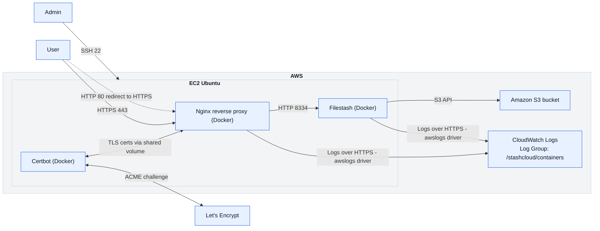
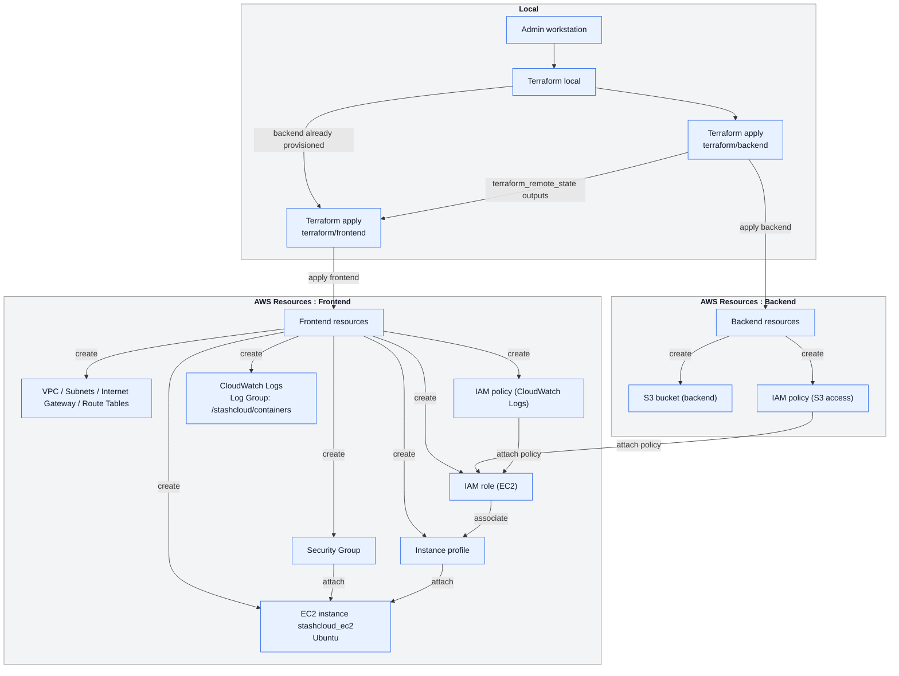
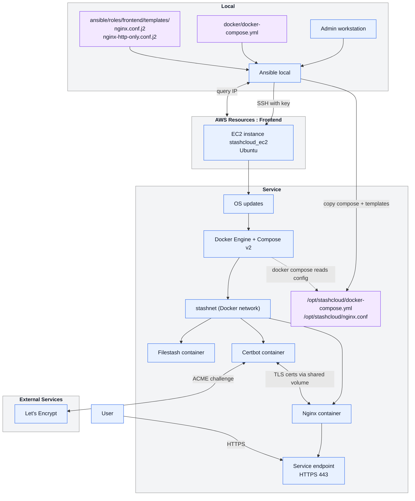
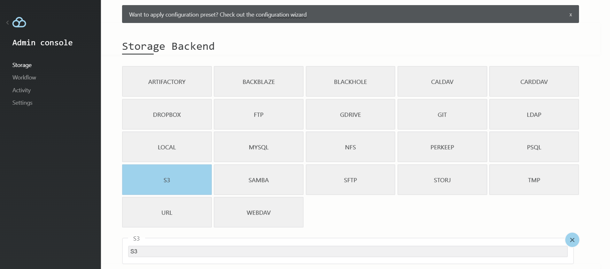
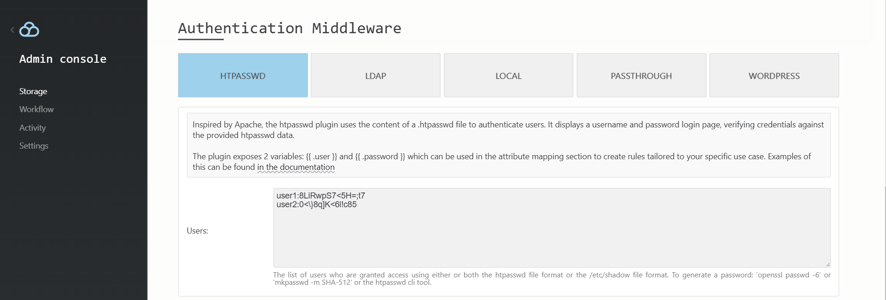
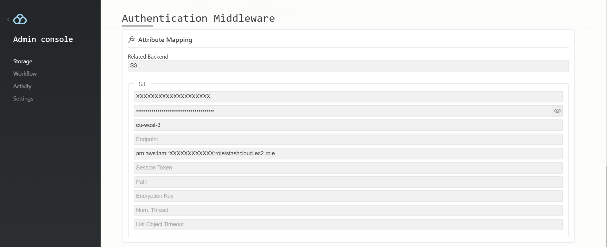

# Stashcloud – Self-hosted shared drive 

Stashcloud is a lightweight, self-hosted shared drive for teams, families, or groups of friends.

It lets you manage files from a web browser without relying on Google Drive/Dropbox-like services or sharing storage access credentials with end users.

Using Filestash as the web interface and an S3 bucket as the file repository, the stack is provisioned end-to-end securely with Terraform + Ansible.

## TL;DR

> **Requires:**
> - Terraform, Ansible, AWS CLI and Git installed on your local machine
> - Python virtualenv with `boto3`, `botocore` and `jmespath`
> - Ansible collections: `amazon.aws` and `community.docker`
> - AWS credentials configured (`aws configure`)
> - SSH key available (e.g. `~/.ssh/id_ed25519`)
> - Configuration files set up from the provided templates:
>   - `terraform/shared.tfvars` (copy from `shared.tfvars.example`) — AWS region, project name, SSH public key
>   - `terraform/frontend/local.tfvars` (copy from `local.tfvars.example`) — your public IP for SSH access
>   - `ansible/inventories/group_vars/frontend/main.yml` — set `certbot_email` to a valid email for Let's Encrypt
>
> See [Prerequisites](#prerequisites) for full details.
```bash
./scripts/start-infra.sh
```

## Prerequisites

* Local workstation (Linux) with the following tools installed:

  * Terraform (tested: 1.14.3)
  * Ansible (tested: 2.10.8)
  * AWS CLI (tested: 2.33.12)
  * Git
  * Python 3 + pip (recommended to use a virtualenv)

* Python dependencies on the control node (your local machine), required for the AWS dynamic inventory:

  * `boto3`
  * `botocore`
  * `jmespath`

* Ansible collections :

  * `amazon.aws` (AWS EC2 dynamic inventory plugin)
  * `community.docker` (Docker Compose v2 module)

  Example :

  ```bash
  python3 -m venv .venv
  source .venv/bin/activate
  pip install -U pip
  pip install boto3 botocore jmespath
  ansible-galaxy collection install amazon.aws community.docker
  ```

 * An AWS account with programmatic access enabled via an Access Key ID / Secret Access Key configured on your workstation (`aws configure`)

* The AWS credentials used on the workstation must allow managing VPC/EC2/EIP, S3, IAM (roles/policies/instance profiles) and CloudWatch Logs

* No AWS static keys are required on the EC2 instance: access to S3 and CloudWatch Logs is provided via the EC2 instance profile (IAM role) and IMDSv2.

*  A local SSH key (private key stored on your workstation, e.g. `~/.ssh/id_ed25519`)

* Network access :

  * Outbound HTTPS access from your workstation to AWS APIs (Terraform + Ansible inventory)
  * Ability to reach the EC2 instance over SSH (22), HTTP (80) and HTTPS (443)

* A valid email address for Let's Encrypt certificate registration (to be set in `ansible/inventories/group_vars/frontend/main.yml` as `certbot_email`)

## Architecture 
High-level view of the target architecture and the main network flows between the client, the Filestash VM, and the S3-compatible Object Storage bucket.


```mermaid
flowchart LR
  %% Infrastructure
  subgraph AWS["AWS"]
    subgraph EC2["EC2 Ubuntu"]
      NGINX["Nginx reverse proxy (Docker)"]
      FS["Filestash (Docker)"]
      CERTBOT["Certbot (Docker)"]
      CERTBOT <-->|TLS certs via shared volume| NGINX
    end
    S3["Amazon S3 bucket"]
    CWL["CloudWatch Logs<br/>Log Group: /stashcloud/containers"]
  end

  LE["Let's Encrypt"]

  %% Network flows
  Admin["Admin"] -->|SSH 22| EC2
  User["User"] -->|HTTPS 443| NGINX
  User -.->|HTTP 80 redirect to HTTPS| NGINX
  NGINX -->|HTTP 8334| FS
  FS -->|S3 API| S3

  %% TLS certificate flow
  CERTBOT <-->|ACME challenge| LE

  %% Centralized logging flows
  NGINX -->|Logs over HTTPS - awslogs driver| CWL
  FS -->|Logs over HTTPS - awslogs driver| CWL

  %% ---- Subgraph styling (backgrounds) ----
  style AWS fill:#F3F4F6,stroke:#CBD5E1,stroke-width:1px,color:#111827,font-size:15px,font-weight:bold
  style EC2 fill:#F3F4F6,stroke:#CBD5E1,stroke-width:1px,color:#111827,font-size:15px,font-weight:bold

  %% ---- Node styling ----
  classDef default  fill:#E8F1FF,stroke:#2563EB,stroke-width:1px,color:#111827;
  classDef fileNode fill:#F3E8FF,stroke:#7C3AED,stroke-width:1px,color:#111827;
```

The target architecture includes:

The target architecture includes:

* An Ubuntu EC2 instance to host Filestash, Nginx and Certbot.
* A Filestash Docker container (web application) accessible through Nginx (HTTPS reverse proxy with TLS termination).
* A Certbot Docker container that automatically obtains TLS certificates from Let's Encrypt using a sslip.io domain derived from the instance's public IP.
* HTTPS access via a sslip.io domain (e.g. `52-47-80-15.sslip.io`), with HTTP requests on port 80 automatically redirected to HTTPS.
* An Amazon S3 bucket to store uploaded files.
* Centralized logging to Amazon CloudWatch Logs for both Nginx and Filestash (Docker `awslogs` log driver).

## Repository structure

```text
stashcloud/
├── ansible/                        # Configuration management (Ansible)
│   ├── inventories/                # Dynamic inventory + group variables
│   │   ├── group_vars/             # Variables scoped by host group
│   │   │   ├── backend/
│   │   │   └── frontend/           # Contains certbot_email for Let's Encrypt
│   │   └── aws_ec2.yaml
│   ├── playbooks/                  # Orchestration playbooks
│   └── roles/
│       ├── base/                   # OS hardening, Docker + AWS CLI install
│       └── frontend/               # Filestash, Nginx, Certbot deployment
│           └── templates/          # Jinja2 templates for Nginx config (HTTP-only + HTTPS)
├── docker/                         # Docker Compose stack definition
├── docs/
│   └── screenshots/                # Filestash setup screenshots for README
├── scripts/                        # Helper scripts (e.g. start-infra.sh)
├── terraform/
│   ├── backend/                    # S3 bucket + IAM policy
│   ├── frontend/                   # VPC, EC2, Security Group, IAM role, CloudWatch Logs
│   │   └── local.tfvars.example    # Template for local variables (e.g. admin IP)
│   └── shared.tfvars.example       # Template for shared Terraform variables
├── ansible.cfg                     # Global Ansible configuration
└── README.md
```
Note: 
* terraform/*/terraform.tfstate* and terraform/*/.terraform/ exist locally but are intentionally ignored by Git for security concerns.

* terraform/shared.tfvars and terraform/frontend/local.tfvars are intentionally kept local-only for security concerns. The repository includes *.tfvars.example files (terraform/shared.tfvars.example, terraform/frontend/local.tfvars.example) as templates to document the required variables.


## Provisionning

### Terraform Workflow :


```mermaid
flowchart TB
  subgraph L[" Local "]
    U["Admin workstation"]
    TF["Terraform local"]
    TFB["Terraform apply<br/>terraform/backend"]
    TFF["Terraform apply<br/>terraform/frontend"]
  end

  subgraph BK["AWS Resources : Backend"]
    direction TB
    BKRES["Backend resources"]
    S3B["S3 bucket (backend)"]
    S3POL["IAM policy (S3 access)"]
  end

  subgraph FR["AWS Resources : Frontend"]
    direction TB
    FRRES["Frontend resources"]
    VPC["VPC / Subnets / Internet Gateway / Route Tables"]
    SG["Security Group"]
    IAMROLE["IAM role (EC2)"]
    IAMPF["Instance profile"]
    LOGPOL["IAM policy (CloudWatch Logs)"]
    CWLG["CloudWatch Logs<br/>Log Group: /stashcloud/containers"]
    EC2["EC2 instance stashcloud_ec2\nUbuntu"]
  end

  U --> TF
  TF --> TFB
  TF -- "backend already provisioned" --> TFF

  TFB -- "apply backend" --> BKRES
  BKRES -- "create" --> S3B
  BKRES -- "create" --> S3POL

  TFB -- "terraform_remote_state outputs" --> TFF

  TFF -- "apply frontend" --> FRRES
  FRRES -- "create" --> VPC
  FRRES -- "create" --> SG
  FRRES -- "create" --> EC2
  FRRES -- "create" --> IAMROLE
  FRRES -- "create" --> IAMPF
  FRRES -- "create" --> LOGPOL
  FRRES -- "create" --> CWLG

  SG -- "attach" --> EC2
  IAMROLE -- "associate" --> IAMPF -- "attach" --> EC2
  S3POL -- "attach policy" --> IAMROLE
  LOGPOL -- "attach policy" --> IAMROLE

%% ---- Subgraph styling (backgrounds) ----
style L  fill:#F3F4F6,stroke:#949494,stroke-width:1px,color:#111827,font-size:15px,font-weight:bold
style BK fill:#F3F4F6,stroke:#949494,stroke-width:1px,color:#111827,font-size:15px,font-weight:bold
style FR fill:#F3F4F6,stroke:#949494,stroke-width:1px,color:#111827,font-size:15px,font-weight:bold
%% ---- Node styling ----
classDef fileNode fill:#F3E8FF,stroke:#7C3AED,stroke-width:1px,color:#111827;
classDef default  fill:#E8F1FF,stroke:#2563EB,stroke-width:1px,color:#111827;
classDef anchorNode fill:transparent,stroke:transparent,stroke-width:0px,color:transparent;
```

### Ansible Workflow :


```mermaid
flowchart TB
  subgraph L[" Local "]
    U["Admin workstation"]
    ANS["Ansible local"]
    DC["docker/docker-compose.yml"]
    TMPL["ansible/roles/frontend/templates/<br/>nginx.conf.j2<br/>nginx-http-only.conf.j2"]
  end

  subgraph FR["AWS Resources : Frontend"]
    direction TB
    EC2["EC2 instance stashcloud_ec2<br/>Ubuntu"]
  end

  subgraph APP["Service"]
    OS["OS updates"]
    DOCKER["Docker Engine + Compose v2"]
    ST["stashnet (Docker network)"]
    NGX["Nginx container"]
    FLS["Filestash container"]
    CERTBOT["Certbot container"]
    EP["Service endpoint<br/>HTTPS 443"]
    OPT["/opt/stashcloud/docker-compose.yml<br/>/opt/stashcloud/nginx.conf"]
  end

  subgraph EXT["External Services"]
    LE["Let's Encrypt"]
  end

  U --> ANS
  ANS -- "query IP" <--> FR
  ANS -- "SSH with key" --> EC2
  ANS -- "copy compose + templates" --> OPT
  DC --> ANS
  TMPL --> ANS

  EC2 --> OS --> DOCKER --> ST
  ST --> NGX --> EP
  ST --> FLS
  ST --> CERTBOT

  CERTBOT <-->|ACME challenge| LE
  CERTBOT <-->|TLS certs via shared volume| NGX

  B["User"] -- HTTPS --> EP
  DOCKER -. "docker compose reads config" .-> OPT

  style L  fill:#F3F4F6,stroke:#949494,stroke-width:1px,color:#111827,font-size:15px,font-weight:bold
  style FR fill:#F3F4F6,stroke:#949494,stroke-width:1px,color:#111827,font-size:15px,font-weight:bold
  style APP fill:#F3F4F6,stroke:#949494,stroke-width:1px,color:#111827,font-size:15px,font-weight:bold
  style EXT fill:#F3F4F6,stroke:#949494,stroke-width:1px,color:#111827,font-size:15px,font-weight:bold

  classDef fileNode fill:#F3E8FF,stroke:#7C3AED,stroke-width:1px,color:#111827;
  classDef default  fill:#E8F1FF,stroke:#2563EB,stroke-width:1px,color:#111827;
  classDef anchorNode fill:transparent,stroke:transparent,stroke-width:0px,color:transparent;

  class DC,TMPL,OPT fileNode;

```

### Runbook :

> **Note**: run the following commands from the repository root (`~/stashcloud`).

#### 1) Provision backend infrastructure (Terraform)

```bash
terraform -chdir=terraform/backend init -var-file=../shared.tfvars 
terraform -chdir=terraform/backend plan -var-file=../shared.tfvars 
terraform -chdir=terraform/backend apply -var-file=../shared.tfvars 
```

#### 2) Provision frontend infrastructure (Terraform)

```bash
terraform -chdir=terraform/frontend init  -var-file=../shared.tfvars -var-file=local.tfvars
terraform -chdir=terraform/frontend plan  -var-file=../shared.tfvars -var-file=local.tfvars
terraform -chdir=terraform/frontend apply  -var-file=../shared.tfvars -var-file=local.tfvars
```

Get EC2 public IP :

```bash
terraform -chdir=terraform/frontend output -raw ec2_public_ip
```

#### 3) Configure the instance and deploy the frontend stack (Ansible)

This playbook:

* updates the OS packages,
* installs Docker Engine and the Docker Compose v2 plugin,
* copies `docker/docker-compose.yml` to `/opt/stashcloud/`,
* deploys Nginx with an HTTP-only config (for the ACME challenge),
* obtains a TLS certificate from Let's Encrypt via Certbot,
* switches Nginx to the full HTTPS config and reloads it.

```bash
ansible-playbook -i ansible/inventories/aws_ec2.yaml ansible/playbooks/provision_front.yml
```

#### 4) If needed : Delete the frontend and backend infrastructures

```bash
terraform -chdir=terraform/frontend destroy -var-file=../shared.tfvars -var-file=local.tfvars

terraform -chdir=terraform/backend destroy -var-file=../shared.tfvars
```


### Validate the deployment :

#### 1) From your local machine

Test access to the remote instance via https :
```bash
# Build the sslip.io FQDN from the EC2 public IP
EC2_IP=$(terraform -chdir=terraform/frontend output -raw ec2_public_ip)
FQDN=$(echo $EC2_IP | tr '.' '-').sslip.io

# Test HTTPS access
curl -v https://$FQDN/
```

Connect using your private key and the instance public IP obtained from Terraform :

```bash
ssh -i ~/.ssh/id_ed25519 ubuntu@$(terraform -chdir=terraform/frontend output -raw ec2_public_ip)
```

#### 2) From the EC2 instance

```bash
# Containers
sudo docker ps

# Logs
sudo docker logs filestash
sudo docker logs nginx
```

If you need a clean restart within the instance:

```bash
sudo docker compose -f /opt/stashcloud/docker-compose.yml down
sudo docker compose -f /opt/stashcloud/docker-compose.yml up -d
```

### Accessing the platform

Once provisioned, the application is accessible via HTTPS at:

    https://<EC2_IP_WITH_DASHES>.sslip.io

For example, if the EC2 public IP is `52.47.80.15`, the URL is:

    https://52-47-80-15.sslip.io

## Filestash setup (admin, users, S3 backend connection)

### 1) Open the Filestash admin console

1. In a web browser, open:
   `https://<EC2_IP_WITH_DASHES>.sslip.io/admin/setup`

2. Set the Filestash admin password (see below)


If the admin password is already configured, open:
`https://<EC2_IP_WITH_DASHES>.sslip.io/admin`
and sign in with the admin password.

---

### 2) Configure S3 as the storage backend

1. In the admin console, go to the Storage configuration (left panel).
2. Select S3 as storage backend, remove others if needed (see below).



---

### 3) Create Filestash users

Under `Authentification Middleware`, select `HTPASSWD` , define a username and password for each user who will access the drive. (see below)


---

### 4) Connect the S3 bucket

You will need the S3 access credentials and the IAM role information used by the instance.

**Get the S3 Access Key and Secret Key (if applicable):**

```bash
cat ~/.aws/credentials
```

**Get the AWS region**

```bash
cat terraform/shared.tfvars
```

**Get the EC2 IAM role ARN:**

```bash
terraform -chdir=terraform/frontend output -raw ec2_role_arn
```
In the box `Attribute Mapping`, enter the required S3 settings : access and secret key, AWS region and IAM role ARN (see below).


---

### 5) Sign in as a user

1. Go back to the Filestash login page:
   `https://<EC2_IP_WITH_DASHES>.sslip.io/`
2. Sign in using one of the user accounts created earlier to access the file manager interface.

## Security

* **HTTPS with valid TLS certificate**: all web traffic is served over HTTPS using a certificate automatically obtained from Let's Encrypt via Certbot. HTTP requests on port 80 are redirected to HTTPS. The certificate is tied to a sslip.io domain derived from the instance's public IP.

* **SSH restricted to `admin_ip` via the Security Group** (port 22 allowed only from your /32).
* **No password authentication**: the Ubuntu image uses key-based SSH only by default.
* **IMDSv2 enforced**: instance metadata access requires a session token (no IMDSv1).
* **No static AWS keys on the EC2 instance**: access to AWS services is provided through an IAM Role
* **Least-privilege IAM policies**:

  * **S3 access policy** (created by the *backend* stack) grants only the required permissions on the dedicated bucket (e.g., list/read/write objects), and is attached to the EC2 role by the *frontend* stack.
  * **CloudWatch Logs policy** (created by the *frontend* stack) grants only the required permissions to publish container logs to CloudWatch Logs.
* **Centralized logging to CloudWatch Logs**: Nginx and Filestash containers use the Docker `awslogs` driver to ship logs over HTTPS to the log group `/stashcloud/containers` (log group managed by Terraform).

